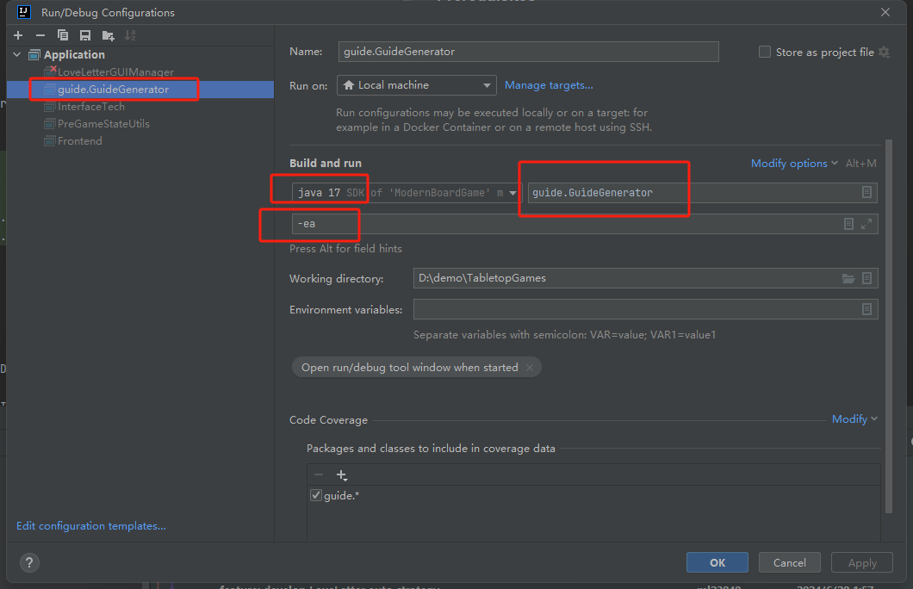
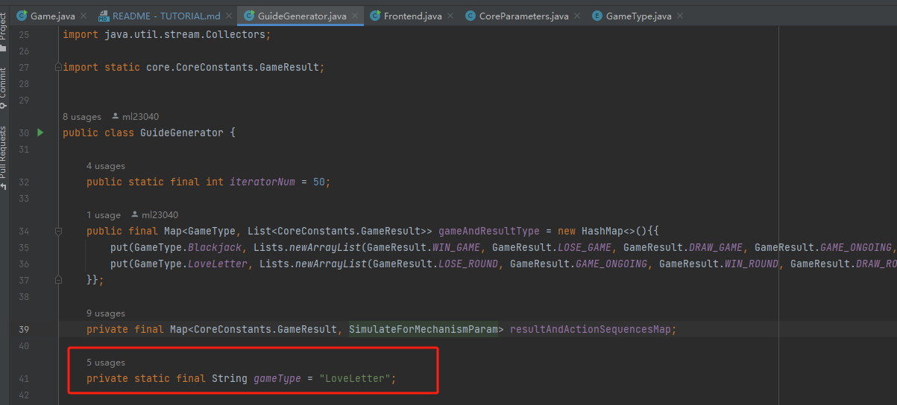

<!-- GETTING STARTED -->
## Getting Started


### Prerequisites

Download JDK 17 from <a href="https://www.oracle.com/java/technologies/javase/jdk17-archive-downloads.html"> Oracle </a> and configure it in the local environment. <a href="https://www.tutorials24x7.com/java/how-to-install-java-17-on-windows"> How to configure? </a>

  ```sh
java --version

java 17.0.10 2024-01-16 LTS
Java(TM) SE Runtime Environment (build 17.0.10+11-LTS-240)
Java HotSpot(TM) 64-Bit Server VM (build 17.0.10+11-LTS-240, mixed mode, sharing)
  ```

### Installation

---
Method 1:
1. Download <b>Blackjack.zip</b> and <b>LoveLetter.zip</b> from qmul Supporting Material Submission and unzip them


2. Navigate to the folder directory in the terminal.
   ```sh
   cd Blackjack
   ```
   or
   ```sh
   cd LoveLetter
   ```
3. Run the command to experience Blackjack
   ```sh
   java -jar Blackjack.jar
   ```
4. Run the command to experience LoveLetter
   ```sh
   java -jar LoveLetter.jar
   ```

----
Method 2:

1. Clone the repo
   ```sh
   git clone https://github.com/df15627980881/TabletopGames.git
   ```
2. Open project in IntelliJ IDEA
3. Switch to the <b>feature_yxl_02</b> branch.
4. Configure the startup class (<b>GuideGenerator.java</b>) parameters with <b>-ea</b>

5. Change the assignment of the <b>gameType</b> variable in the <b>GuideGenerator.class</b> to either <b>Blackjack</b> or <b>LoveLetter</b>

6. run <b>GuideGenerator.java</b>


